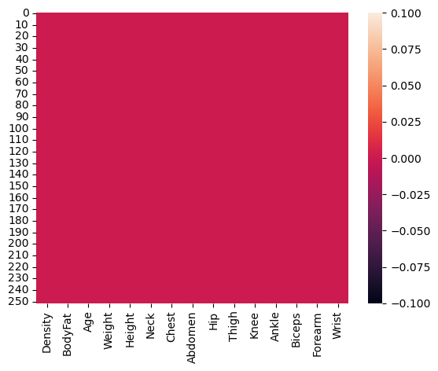
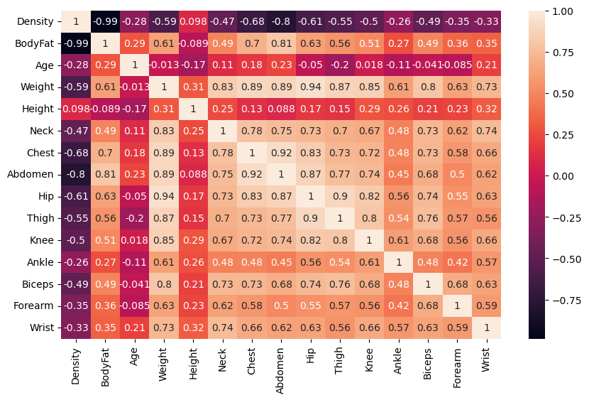
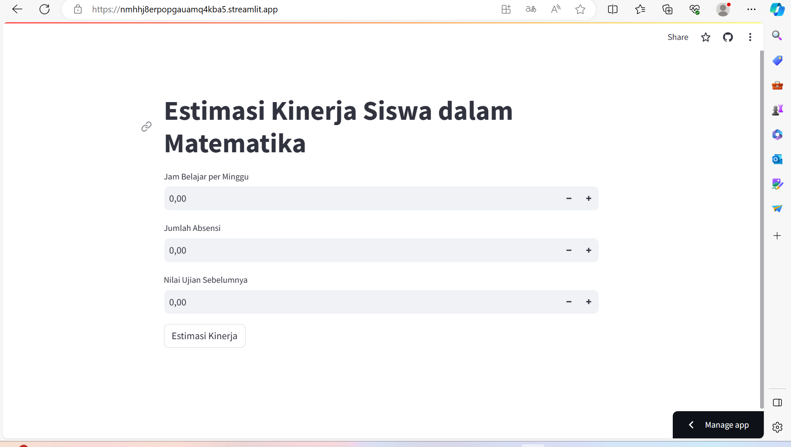

# Laporan Proyek Machine Learning
### Nama  : Aloysius Manuel Bayu Krisnamurti
### Nim   : 211351012
### Kelas : TIF Malam A

## Domain Proyek

Proyek ini bertujuan untuk menganalisis dan memprediksi persentase lemak tubuh untuk menganalisis dan memprediksi komposisi tubuh individu. Persentase lemak tubuh adalah parameter kesehatan yang krusial, dan pemahaman yang mendalam tentang faktor-faktor yang memengaruhi persentase lemak tubuh sangat penting untuk berbagai kepentingan, termasuk profesional medis, pelatih kebugaran, dan individu yang peduli akan kesehatan dan kebugaran mereka. Analisis ini akan membantu dalam mengidentifikasi hubungan antara berbagai variabel, seperti berat badan, tinggi badan, usia, dan pengukuran tubuh, dengan persentase lemak tubuh. Data yang digunakan dalam proyek ini mencakup berbagai fitur fisik dan demografis, sehingga dapat memberikan wawasan yang berguna tentang kesehatan dan kebugaran individu. Dengan informasi ini, proyek ini akan memberikan pemahaman yang lebih baik tentang komposisi tubuh manusia, yang dapat digunakan untuk mengambil keputusan kesehatan yang lebih baik.

## Business Understanding

Proyek prediksi persentase lemak tubuh bertujuan untuk memberikan wawasan yang mendalam tentang komposisi tubuh manusia. Persentase lemak tubuh adalah faktor penting dalam kesehatan dan kebugaran individu, dan pemahaman yang kuat tentang hal ini sangat penting untuk berbagai pemangku kepentingan, termasuk dokter, pelatih kebugaran, dan individu yang peduli tentang kesehatan mereka. Analisis ini akan membantu dalam mengidentifikasi faktor-faktor yang memengaruhi persentase lemak tubuh, seperti berat badan, tinggi badan, usia, dan ukuran tubuh lainnya, sehingga memungkinkan pihak-pihak yang terlibat untuk membuat keputusan yang lebih baik terkait dengan kesehatan dan kebugaran.

Bagian laporan ini mencakup :

### Problem Statements

Menjelaskan pernyataan masalah latar belakang:
- Pernyataan Masalah 1: Bagaimana kita dapat memprediksi persentase lemak tubuh dengan akurasi tinggi?
- Pernyataan Masalah 2: Apa faktor-faktor yang paling memengaruhi persentase lemak tubuh?
- Pernyataan Masalah 3: Bagaimana prediksi persentase lemak tubuh ini dapat membantu individu dalam menjaga kesehatan mereka?

### Goals

Menjelaskan tujuan dari pernyataan masalah:
- Jawaban pernyataan masalah 1: Membangun model prediksi persentase lemak tubuh yang akurat.
- Jawaban pernyataan masalah 2: Mengidentifikasi atribut fisik dan demografis yang paling berpengaruh terhadap persentase lemak tubuh.
- Jawaban pernyataan masalah 3: Memberikan panduan kepada individu dalam menjaga kesehatan berdasarkan prediksi persentase lemak tubuh.

### Solution statements
- Kami akan menggunakan algoritma regresi untuk membangun model prediksi.
- Kami akan mengevaluasi model dengan metrik seperti F1 score

## Data Understanding
Data yang digunakan dalam proyek ini adalah [Body Fat Prediction Dataset]([https://www.kaggle.com/datasets/fedesoriano/body-fat-prediction-dataset/code]).

#### Variabel-variabel pada Body Fat Prediction Dataset adalah sebagai berikut:
-Density = ('Kepadatan') (float64)

-BodyFat = ('Lemak Badan') (float64)

-Age = ('Umur') (int64)

-Weight = ('Berat') (float64)

-Height = ('Tinggi') (float64)

-Neck = ('Leher') (float64)

-Chest = ('Dada') (float64)

-Abdomen = ('Perut') (float64)

-Hip = ('Pinggul') (float64)

-Thigh = ('Paha') (float64)

-Knee = ('Lutut') (float64)

-Ankle = ('Pergelangan Kaki') (float64)

-Biceps = ('Bisep') (float64)

-Forearm = ('Lengan Bawah') (float64)

## Data Preparation

#### Data Collection
Merupakan data yang saya dapatkan dari website kaggle dengen nama Body Fat Prediction Dataset, jika tertarik bisa klik link nya di Data Understanding

#### Data Discovery And Profiling
Untuk bagian ini, kita menggunakan teknik EDA. Pertama kita mengimport semua library yang dibutuhkan,

`import pandas as pd`

`import numpy as np`

`import matplotlib.pyplot as plt`

`import seaborn as sns`

Mari kita lanjutkan dengan memasukkan file csv yang telah di extract pada sebuah variable 

`df = pd.read_csv('bodyfat.csv')`

Untuk melihat kolom kita masukkan untuk mengetahui lemak, dll

`df.head()`

Selanjutnya  kita masukkan seperti dibawah untuk melihat info

`df.info()`

Selanjutnya masukkan ini

`sns.heatmap(df.isnull())`

Untuk mengetahui kita gunakan ini

`df.describe()`

Selanjutnya masukkan plot figurnya

`plt.figure(figsize=(10,6))`

`sns.heatmap(df.corr(), annot=True)`

Selanjutnya masukkan fiturnya

`fitur = ['Density', 'BodyFat', 'Age', 'Weight','Height','Neck','Chest','Abdomen','Hip','Thigh','Knee','Ankle','Biceps','Forearm']`

`x = df[fitur]`

`y = df['Wrist']`

`x.shape, y.shape`

Untuk mengetahui hasilnya kita masukkan rumus ini

`from sklearn.model_selection import train_test_split`

`x_train, X_test, y_train, y_test = train_test_split(x, y, random_state = 70)`

`y_test.shape`

Waduh, ternyata proses nya banyak dan mari kita lanjutkan

## Modeling
Sebelumnya mari kita import library yang akan kita gunakan

`from sklearn.linear_model import LinearRegression`

`lr = LinearRegression()`

`lr.fit(x_train,y_train)`

`predik = lr.predict(X_test)`

Selanjutnya masukkan akurasi model regresi liniernya

`y = lr.score(X_test, y_test)`

`print('Akurasi Model Regresi Linier : ', y)`

Kita masukkan imputan dan prediksinya

`#Density = 1.108900 (float64), BodyFat = 47.500000 (float64), Age = 81.000000 (int64), Weight = 363.150000 (float64), Height = 77.750000 (float64), Neck = 51.200000 (float64), Chest = 136.200000 (float64), Abdomen = 148.100000 (float64), Hip = 147.700000 (float64), Thigh = 87.300000 (float64), Knee = 49.100000 (float64), Ankle = 33.900000 (float64), Biceps = 45.000000 (float64)`

`inputan = np.array([[1.108900, 47.500000, 81.000000, 363.150000, 77.750000, 51.200000, 136.200000, 148.100000, 147.700000, 87.300000, 49.100000, 33.900000, 45.000000, 34.900000]]) 
prediksi = lr.predict(inputan)`

`print('Estimasi Persentase Lemak Tubuh : ',prediksi)`

Sekarang modelnya sudah selesai, mari kita eksport sebagai sav agar nanti kita bisa gunakan pada project web streamlit kita

`import pickle`

`filename = 'bodyfat.sav'`

`pickle.dump(lr,open(filename,'wb'))`

## Evaluation
Pada bagian ini saya menggunakan F1 score sebagai metrik evaluasi
- F1 Score: F1 score adalah rata-rata harmonis antara presisi dan recall. F1 score memberikan keseimbangan antara presisi dan recall. F1 score dihitung dengan menggunakan rumus sebagai berikut :

`from sklearn.linear_model import LinearRegression`

`lr = LinearRegression()`

`lr.fit(x_train,y_train)`

`predik = lr.predict(X_test)`

`y = lr.score(X_test, y_test)`

`print('Akurasi Model Regresi Linier : ', y)`

Dan hasil yang didapatkan adalah 0.7205555367678251 atau 72%, itu berarti model ini memiliki nilai yang baik antara presisi dan recall. Karena dapat kita cari untuk mengetahui prediksi persentase lemak tubuh yang dibutuhkan.

## Deployment
[My Prediction App](https://57gajmdtnpnnvhnz52npmk.streamlit.app/).

