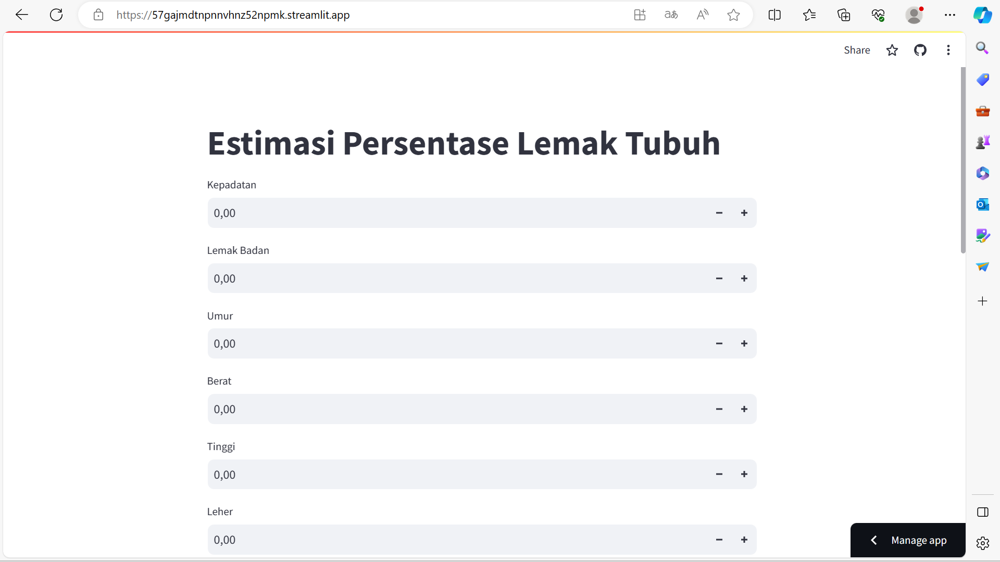

# Laporan Proyek Machine Learning
### Nama  : Aloysius Manuel Bayu Krisnamurti
### Nim   : 211351012
### Kelas : TIF Malam A

## Domain Proyek

Proyek ini bertujuan untuk memprediksi persentase lemak tubuh (body fat percentage) seseorang berdasarkan sejumlah atribut fisik dan demografis.

## Business Understanding

Untuk memprediksi persentase lemak tubuh.

Bagian laporan ini mencakup:

### Problem Statements

Menjelaskan pernyataan masalah latar belakang:
- Pernyataan Masalah 1: Bagaimana kita dapat memprediksi persentase lemak tubuh dengan akurasi tinggi?
- Pernyataan Masalah 2: Apa faktor-faktor yang paling memengaruhi persentase lemak tubuh?
- Pernyataan Masalah 3: Bagaimana prediksi persentase lemak tubuh ini dapat membantu individu dalam menjaga kesehatan mereka?

### Goals

Menjelaskan tujuan dari pernyataan masalah:
- Jawaban pernyataan masalah 1: Membangun model prediksi persentase lemak tubuh yang akurat.
- Jawaban pernyataan masalah 2: Mengidentifikasi atribut fisik dan demografis yang paling berpengaruh terhadap persentase lemak tubuh.
- Jawaban pernyataan masalah 3: Memberikan panduan kepada individu dalam menjaga kesehatan berdasarkan prediksi persentase lemak tubuh.

### Solution statements
- Kami akan menggunakan algoritma regresi untuk membangun model prediksi.
- Kami akan mengevaluasi model dengan metrik seperti R-squared dan Mean Absolute Error (MAE)

## Data Understanding
Data yang digunakan dalam proyek ini adalah [Body Fat Prediction Dataset](kaggle datasets download -d fedesoriano/body-fat-prediction-dataset).

#### Variabel-variabel pada Student Performance Prediction adalah sebagai berikut:
Density = st.number_input('Kepadatan')
BodyFat = st.number_input('Lemak Badan')
Age = st.number_input('Umur')
Weight = st.number_input('Berat')
Height = st.number_input('Tinggi')
Neck = st.number_input('Leher')
Chest = st.number_input('Dada')
Abdomen = st.number_input('Perut')
Hip = st.number_input('Pinggul')
Thigh = st.number_input('Paha')
Knee = st.number_input('Lutut')
Ankle = st.number_input('Pergelangan Kaki')
Biceps = st.number_input('Bisep')
Forearm = st.number_input('Lengan Bawah')

## Data Preparation

#### Data Collection
Merupakan data yang saya dapatkan dari website kaggle dengen nama Student Performance Prediction, jika tertarik bisa klik link nya di Data Understanding

#### Data Discovery And Profiling
Untuk bagian ini, kita menggunakan teknik EDA. Pertama kita mengimport semua library yang dibutuhkan,

`import pandas as pd`
`import numpy as np`
`import matplotlib.pyplot as plt`
`import seaborn as sns`
`import os`

Karena kita menggunakan VS Code untuk mengerjakannya maka kita ketik seperti yang dibawah

`for dirname, _, filenames in os.walk('/kaggle/input/student-performance-in-mathematics/exams.csv'):`
    `for filename in filenames:`
        `print(os.path.join(dirname, filename))`

Mari kita lanjutkan dengan memasukkan file csv yang telah di extract pada sebuah variable 

`df=pd.read_csv('exams.csv')`

Untuk melihat kolom kita masukkan untuk mengetahui tingkat pendidikan yang dicapai orang tua dll

`df.head()`

Selanjutnya  kita masukkan seperti dibawah untuk melihat bentuknya

`df.shape`

Untuk memeriksa apakah dataset terdapat baris yang kosong kita bisa gunakan ini

`df.isnull().sum()`

Selanjutnya kita masukkan ekor seperti dibawah

`df.tail()`

Untuk mengetahui hasil ujiannya kita gunakan ini

`df.describe()`

Untuk melihat tipe data nya kita bisa menggunakan property info

`df.info()`

Karena di dalamnya terdapat satu kolom yang tidak kita inginkan, maka akan kita drop kolom tersebut

`categorical=df.drop(['math score','reading score', 'writing score','avarage score'], axis=1)`
`numerical=df[['math score','reading score', 'writing score','avarage score']]`

Selanjutnya kita kategorikan

`categorical`

Selanjutnya kita numerikan

`numerical`

Untuk mengkategorikan kita gunakan kategori untuk mengfaktorkan

`df1= categorical.apply(lambda x: pd.factorize(x)[0])`

Hasil nya seperti dibawah

`df1`

Untuk medatakan kita gunakan rumus dibawah

`data=pd.concat([df1,numerical],axis=1,ignore_index=True)`

Hasil nya seperti dibawah

`data`

Selanjutnya untuk membuat kolom baru kita masukkan variabel - variabelnya  

`new_columns_name={0:'gender',1:'race',2:'parent education',3:'lunch',4:'preparetion tests',5:'math',6:'reading',7:'writing',8:'avarage'}`
`data=data.rename(columns=new_columns_name)`

Hasilnya seperti dibawah
`data`

Untuk mengetahui rata rata nya kita gunakan rumus ini

`x=data.drop(['avarage'],axis=1)`
`y=data['avarage']`

Waduh, ternyata proses nya banyak dan mari kita lanjutkan

## Modeling
Sebelumnya mari kita import library yang akan kita gunakan

`from sklearn.model_selection import train_test_split`
`from sklearn.linear_model import LinearRegression`
`from sklearn.metrics import mean_squared_error,r2_score`

Selanjutnya kita akan menentukan berapa persen dari dataset yang akan digunakan untuk mengetestnya kita gunakan train

`x_train, x_test, y_train, y_test = train_test_split(x, y, test_size=0.2, random_state=42)`

Mari kita lanjutkan dengan membuat Linear Regresinya

`lr= LinearRegression()`
`model=lr.fit(x_train, y_train)`

Untuk mengetahui prediksinya modelnya kita gunakan rumus ini

`predict = model.predict(x_test)`

Untuk mengetahui erornya kita gunakan rumus ini

`(mean_squared_error(predict,y_test))**0.5`

Sekarang kita akan melihat hasil ujiannya

`r2_score(predict,y_test)`

Selanjutnya kita akan mengimport Ridge sebagai R dan Lasso sebagai L

`from sklearn.linear_model import Ridge, Lasso`
`R=Ridge()`
`L=Lasso()`

Selanjutnya kita gunakan x_train untuk mengetahui berapa persennya

`R.fit(x_train,y_train)`

Mari kita prediksi Ridge nya berapa persen

`predict2=R.predict(x_test)`
`(mean_squared_error(predict2,y_test))**0.5`

Nah sekarang kita akan melihat hasil ujiannya

`r2_score(predict2,y_test)`

Sekarang kita berganti ke Lasso untuk mengetahui berapa persennya

`L.fit(x_train,y_train)`

Untuk memprediksinya kita gunakan rumus ini

`predict3=L.predict(x_test)`

Untuk mengetahui bentuk eror nya yang di prediksi dalam bentuk persen

`(mean_squared_error(predict3,y_test))**0.5`

Sekarang kita gunakan prediksi hasil ujian untuk mengetahui berapa persennya

`r2_score(predict3,y_test)`

Sekarang modelnya sudah selesai, mari kita eksport sebagai sav agar nanti kita bisa gunakan pada project web streamlit kita

`import pickle`
`filename = '1-student-performance-prediction.sav'`
`pickle.dump(lr,open(filename,'wb'))`

## Evaluation
Pada bagian ini saya menggunakan F1 score sebagai metrik evaluasi
- F1 Score: F1 score adalah rata-rata harmonis antara presisi dan recall. F1 score memberikan keseimbangan antara presisi dan recall. F1 score dihitung dengan menggunakan rumus sebagai berikut :

`from sklearn.model_selection import train_test_split`
`from sklearn.linear_model import LinearRegression`
`from sklearn.metrics import mean_squared_error,r2_score`

`x_train, x_test, y_train, y_test = train_test_split(x, y, test_size=0.2, random_state=42)`

`lr= LinearRegression()`
`model=lr.fit(x_train, y_train)`

`predict = model.predict(x_test)`

`(mean_squared_error(predict,y_test))**0.5`

`r2_score(predict,y_test)`

`1-student-performance-prediction.ipynb`

`R.fit(x_train,y_train)`

`predict2=R.predict(x_test)`
`(mean_squared_error(predict2,y_test))**0.5`

`r2_score(predict2,y_test)`

Dan hasil yang didapatkan adalah 0.9999999999941458 atau 99.9%, itu berarti model ini memiliki nilai yang baik antara presisi dan recall. Karena dapat kita cari untuk mengetahui prediksi kinerja siswa yang dibutuhkan.

## Deployment
[My Prediction App](https://57gajmdtnpnnvhnz52npmk.streamlit.app/).

